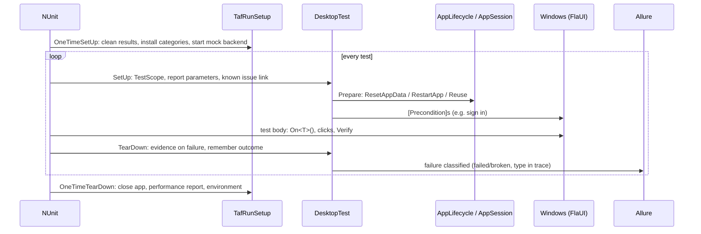

# Architecture

## Projects

| Project | Contains |
|---|---|
| `src/Taf.Desktop.Core` | The framework |
| `tests/Taf.Desktop.Core.Tests` | Unit tests of the framework; the window model runs against fake UI trees, so no app is needed |
| `examples/Taf.Desktop.Examples` | Example tests, windows, preconditions and the mock backend of the demo app |
| `demo/ShopDesk.*` | Demo app: UI-independent core, WPF and WinForms flavours with identical AutomationIds |

Build settings live in `Directory.Build.props`, package versions in `Directory.Packages.props` (central package
management). All output goes to `artifacts/`.

## Namespaces of `Taf.Desktop.Core`

```
Config/        TafConfig (layered config), RuntimeOverrides, SecretsGuard
Testing/       TafTest, DesktopTest, TafRunSetup, TestScope, [KnownIssue], [Quarantined], [InfraRetry], failure normalizer
App/           AppSession (process + UIA3), AppOptions, AppLifecyclePolicy / AppLifecycle, [FreshApp], [ResetAppData]
Ui/            IUiNode + FlaUiNode, Locator / [Locate], Window, Component, UiElement(s), ComponentList, WindowFactory,
               [WindowIdentifier], [WaitForGone], Wait, MessageBoxDialog, FileDialog
Evidence/      FailureEvidence, UiTree, ScreenRecorder
Mocking/       MockBackend (WireMock.Net)
Users/         TestUsers, UserCredentials, [TestUser]
Preconditions/ PreconditionAttribute, PreconditionContext
Perf/          PerfCollector, PerfReport
Verification/  Verify
Reporting/     Step, Attach, Log, AllureResults, ReportFiles
Lint/          MetadataLinter
Failures/      failure taxonomy
```

## Lifecycle of a test



## Design decisions

- **A tree abstraction under the window model.** `IUiNode` decouples windows and elements from FlaUI, so locating,
  naming, waiting, selecting and menu navigation are unit tested against fake trees.
- **Lazy, re-located elements.** A `UiElement` stores how to find an element, never the element itself. There are
  no stale references and no implicit waits.
- **Names everywhere.** Elements know `Window.field[index]`, so failures and report steps explain themselves.
- **Click strategy per UI stack.** Invoke where it is safe (WPF/XAML), the mouse where Invoke can block (WinForms,
  Win32 modal dialogs).
- **Cheapest safe start.** The lifecycle policy restarts the app by default, and reuses or resets it only when that
  is needed or requested.
- **Evidence over logs.** A screenshot and the UI tree are attached exactly where the failure happened.
